# Práctica #1

---

**Nombre del proyecto**: Práctica #1 - Primera PCB

**Equipo:** Sebastián Montaño y Juan Jacobo Flórez

**Asignatura:** Producción Electrónica

**Fecha:** 19/09/2025

---
### Resumen

El proyecto constituyó un primer acercamiento al diseño y fabricación de PCB, utilizando KiCad como herramienta principal. Se aplicaron criterios básicos de diseño, como la separación entre pistas y la organización de componentes, buscando obtener una placa confiable y compacta. Más allá de lograr un diseño funcional y limpio, la actividad permitió comprender cómo planificar el enrutado, organizar los elementos en el espacio disponible y reconocer las limitaciones de las herramientas disponibles.

---

### Diseño de la PCB

#### Configuración inicial en KiCad

Para empezar en KiCad, realizamos la descarga de bibliotecas que contuvieran no solo los componentes, sino también las huellas de los componentes que iban a ser utilizados de manera recurrente en la clase. El menú principal de KiCad nos muestra varias opciones y herramientas que podemos utilizar.

Las dos más relevantes en nuestro caso son el **editor de esquemas** y el **editor de placas**. El editor de esquemas es el que nos permite construir el esquemático de nuestro circuito; este trabaja como plano y nos muestra a qué debe estar conectada cada elemento.

<figure style="text-align:center;">
  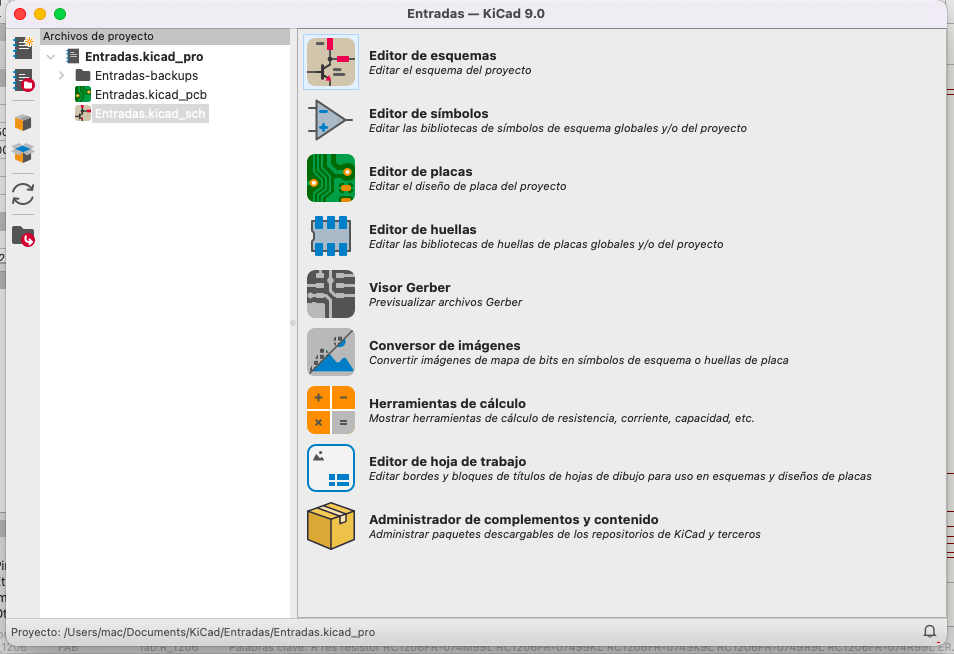
  <figcaption style="font-size:0.9em; color:gray;">Página principal KiCad</figcaption>
</figure>

#### Trabajo con el editor de esquemas

El editor de esquemas funciona como el plano eléctrico de nuestro circuito. Aquí definimos qué componentes necesitamos y cómo se conectan entre sí, sin preocuparnos aún por la disposición física en la placa.

**Colocación de componentes:**
Para agregar componentes al esquema, utilizamos el comando `(A)`. Esto abre una biblioteca organizada por categorías donde podemos buscar y seleccionar el componente deseado. Cada componente viene con su respectiva huella, que será crucial más adelante en el editor de placas.

<figure style="text-align:center;">
  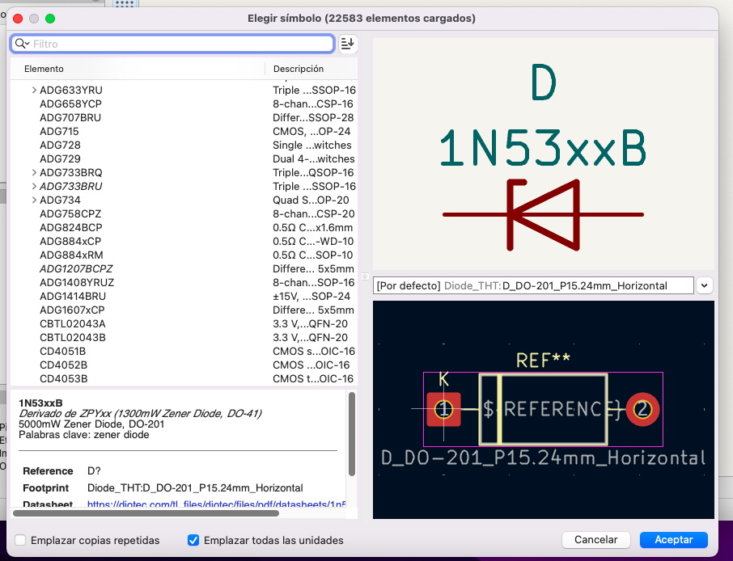
  <figcaption style="font-size:0.9em; color:gray;">Menú de componentes (A).</figcaption>
</figure>

**Métodos de conexión:**
Para conectar los componentes tenemos dos opciones principales:

1. **Conexiones con cable `(W)`**: Se utilizan para conexiones directas y visibles entre componentes cercanos. Son ideales cuando queremos ver claramente la ruta de la conexión.

2. **Etiquetas `(L)`**: Son especialmente útiles para conexiones entre puntos distantes del esquema. En lugar de dibujar cables largos que pueden ensuciar el diagrama, colocamos etiquetas con el mismo nombre en los puntos que queremos conectar. KiCad entiende automáticamente que estos puntos están conectados eléctricamente.

Las etiquetas no solo simplifican visualmente el esquema, sino que también facilitan la comprensión del circuito al dar nombres descriptivos a las señales (por ejemplo: "VCC" y "GND").

#### Esquemático del circuito

En nuestro caso, se nos entregó un esquemático de un circuito con cuatro entradas, cada una asociada a una única salida. Dichas salidas tienen como receptor de la señal un diodo LED, el cual actúa como indicador visual del funcionamiento del circuito.

A continuación, se presenta el esquemático correspondiente:
  
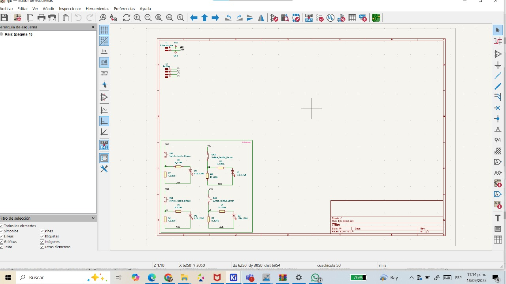{ align=center } 

#### Transición al editor de placas

Para acceder al editor de placas se utiliza el icono verde en la esquina superior derecha en la barra de herramientas del editor de esquemas y una vez en el editor de placas ocupamos la misma ruta para regresar al editor de esquemas. De regreso en el editor de placas es necesario hacer una actualización de placa desde el esquema, esto nos abrirá un menú con posibles errores de nuestro esquema y nos permitirá visualizar las huellas de nuestros componentes.

<figure style="text-align:center;">
  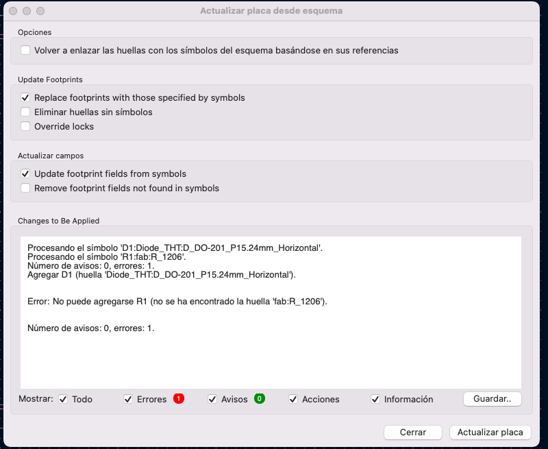
  <figcaption style="font-size:0.9em; color:gray;">Actualización de placa desde esquema.</figcaption>
</figure>

#### Consideraciones de diseño

En el diseño de la PCB fue necesario analizar las limitaciones de las herramientas disponibles; en este caso utilizamos la *Roland monoFab SRM-20*. Con base en estas limitaciones, se definió una separación mínima entre pistas de **0.4 mm**, valor que garantiza la fabricabilidad de la placa, este lo definimos en la sección de **Pista:** en la esquina superior izquierda.

De igual forma, se evitó el uso de esquinas de 90° en las pistas, ya que este tipo de trazos puede generar acumulación de cargas eléctricas y dificultar el flujo de la corriente. Adoptar desde ahora estas buenas prácticas resulta importante para asegurar la escalabilidad de futuros proyectos.

#### Optimización del layout

Adicionalmente, se buscó la organización más óptima de los componentes, priorizando la simplicidad del enrutado y la reducción del área ocupada. Con ello se logró que la placa utilizara únicamente los recursos necesarios, manteniendo un diseño limpio.

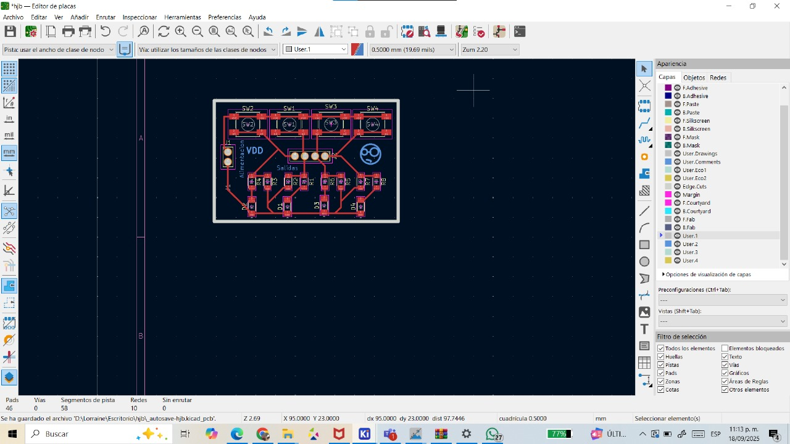{ align="center" width="95%" }

!!! tip "Importante!"
    Entrar al panel de revisión y ejecutar el DRC para verificar que haya la menor cantidad de errores.

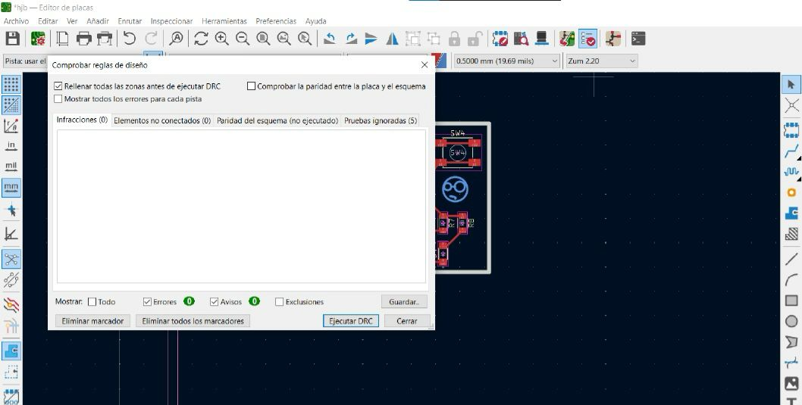{ align="center" width="99%" }

#### Preparación para fabricación

Una vez definida la organización de la placa nos dirigimos hacia el menu de **Archivo** donde habra que seleccionar la **Salidas de fabricacion** --> `gerber(.gbr)`, añadimos las etiquetas y logotipos necesarios a la capa `User.2`, el contorno a `EdgeCuts`, las pistas en `F.Cu` y los orificios donde pasarán nuestros pines los colocamos en la capa `User.1`. Todo esto busca otorgarnos mayor control sobre cómo se fabrica cada uno de los segmentos que conforman la PCB. Al momento de guardar las capas que íbamos a utilizar, se guardó su trazo en formato de vectores SVG.

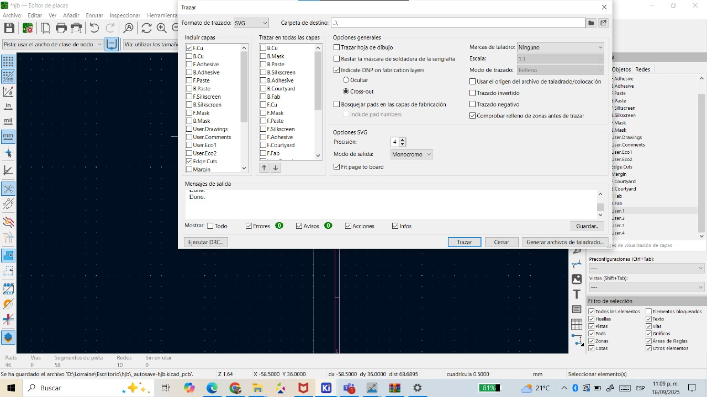{ align=center } 

!!! tip "Importante!"
    La casilla de Fit page to board tiene que estar marcada y el formato de trazado debe estar en SVG.

---

### Uso de Mods CE

Esta herramienta web fue la que nos ayudó a convertir los trazos SVG en código G que nuestra CNC pudo comprender. Para ello accedimos a la página de [Mods][doc-ref].

Comenzamos dirigiéndonos a **programs --> open program --> Roland --> SRM-20mill --> mill 2D PCB**. Se nos despliega la interfaz en la que configuramos cómo se maquinaría cada capa de nuestra PCB. Iniciamos con el trazo de las pistas. En el módulo **read SVG** cargamos el archivo correspondiente a las pistas. Estas deben invertirse en el módulo **Convert SVG**.

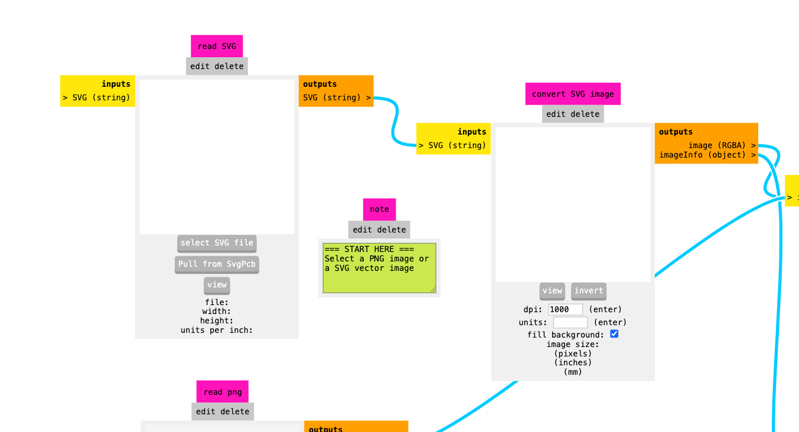{ align="center" width="85%" } 

Posteriormente configuramos la herramienta con la que íbamos a realizar el grabado de la PCB. Como estábamos grabando las pistas, es importante seleccionar la herramienta `mill traces 1/64` en el módulo **set PCB defaults**, ya que contiene las configuraciones del tamaño de la herramienta, profundidad y velocidad de trabajo.

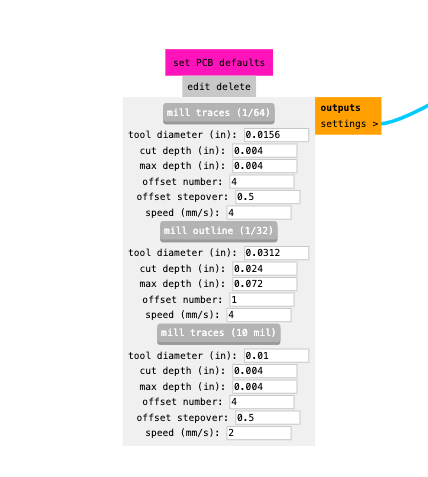{ align="center" width="55%" } 

!!! tip "PCB DEFAULTS"
    Para nuestras capas de hoyos y perímetro de la placa se usó la herramienta `mill traces 1/32`

En el módulo **mill raster 2D** pudimos visualizar el recorrido de la máquina utilizando los botones `calculate` y `view`. Aquí modificamos el valor de offset number a `2` o `3` para asegurar la limpieza del trazo. En configuraciones de hoyos o contorno, se colocó el tool diameter en `0.99mm`.

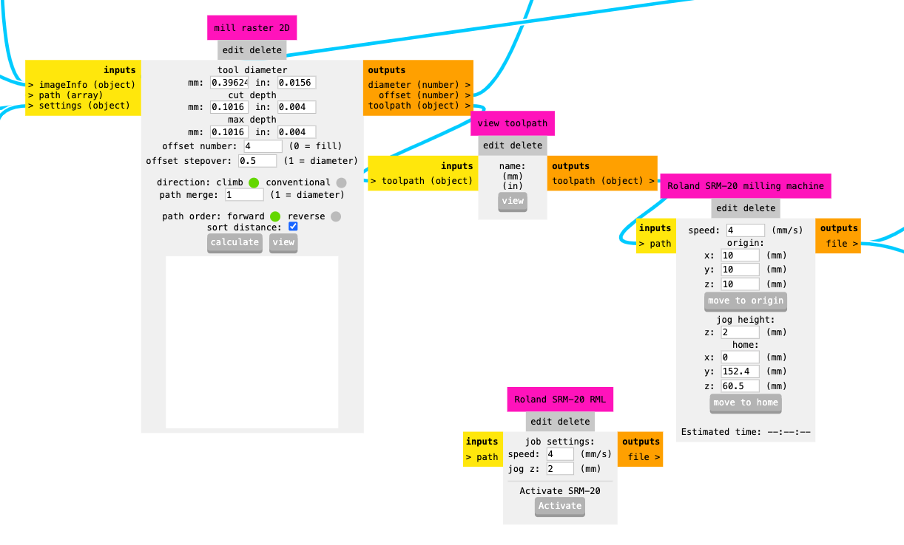{ align="center" width="110%" } 

En el módulo **Roland SRM-20 milling machine** se muestra la velocidad a la que se moverá la herramienta y una estimación del tiempo que tomará realizar el trazo.

!!! tip "Roland SRM-20 milling machine"
    En este módulo se deben establecer X, Y y Z en valores de `0` y cambiar la velocidad según el trazo: perforaciones a `0.4mm/s`, contorno a `1mm/s`, y para etiquetas/pistas usar la velocidad default de `4mm/s`.

Hay que dirigirse a la sección **inputs on/offs** y activar el módulo inferior, el cual nos ayudará a guardar el archivo cada vez que presionemos `calculate`.

!!! tip "Recomendable"
    Cambiar el nombre del archivo guardado ya que viene con un nombre por defecto que puede generar confusiones.

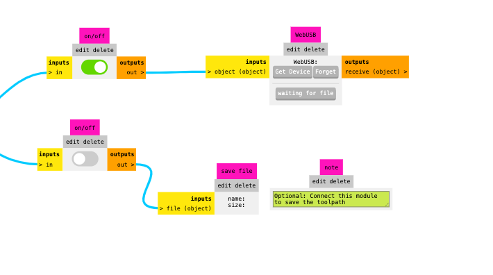{ align="center" width="87%" } 

--- 

### Uso de la monoFab

Para utilizar la *monoFab*, primero debemos asegurarnos de tener descargada la aplicación **VPanel** junto con los drivers necesarios para su funcionamiento. Una vez que cumplimos con estos requerimientos, conectamos nuestro equipo a la máquina mediante un cable USB y abrimos **VPanel**, lo cual nos desplegará una ventana de control de la máquina.

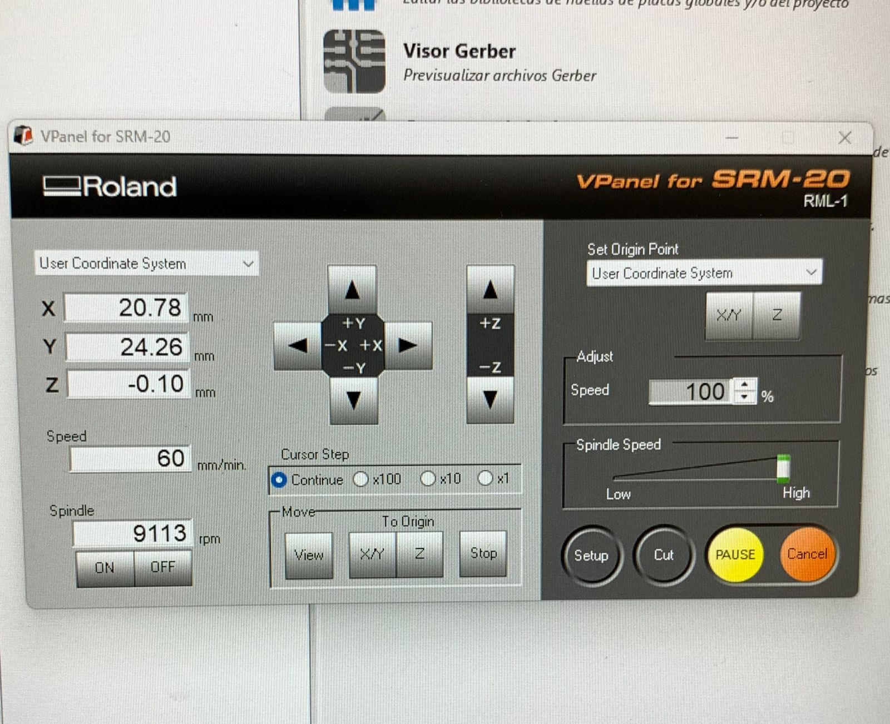{ align="center" width="99%" }

Este panel nos permite mover la máquina sobre sus 3 ejes y activar el movimiento del motor de la herramienta. En el costado derecho podemos fijar nuestros ejes `X/Y` y `Z`, los cuales se controlan utilizando las flechas direccionales. La máquina puede moverse a distintas magnitudes de paso: continua, `x100`, `x10` y `x1`.

!!! tip "Definir Orígenes"
    Al definir el origen en los ejes X y Y, es importante recordar que representa nuestra esquina inferior izquierda, y todo el trazado se realizará hacia la derecha de este punto.

Para instalar el herramental, es necesario aflojar parcialmente el tornillo prisionero que sostendrá la herramienta una vez insertada. Es importante apretarlo lo suficiente para mantener la herramienta firmemente en su lugar, pero sin excederse.

<figure style="text-align:center;">
  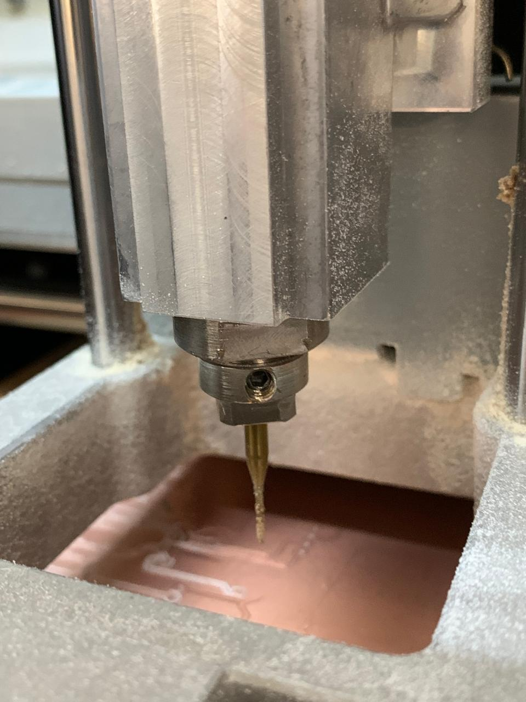
</figure>

En la esquina inferior izquierda del VPanel se encuentra la sección **Spindle**, que nos permite monitorear la velocidad de rotación de nuestra herramienta y controlar el encendido o apagado del motor que la acciona.

Para realizar el corte, cargamos el archivo `.rml` generado por mods en la sección **Cut**, posteriormente seleccionamos `output` y comenzamos con el proceso de corte de nuestra placa.

---

## Maquinado 

A continuación se observa el proceso de maquinado de nuestra placa:

<video width="640" height="360" controls muted>
  <source src="https://github.com/jacobflrz/Prod_ele/releases/download/v1.0/cncc.mp4" type="video/mp4">
  Tu navegador no soporta el video.
</video>

Este fue el resultado final de la placa:

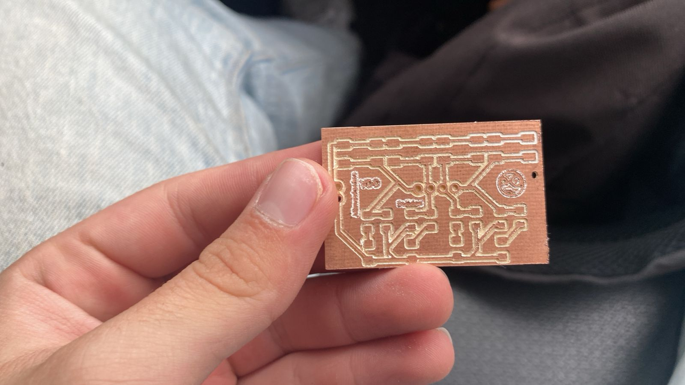{ align="center" width="75%" }

En general, el resultado fue exitoso, ya que las pistas mantienen su tamaño en la mayoría de la placa. Solo en algunas zonas, debido a la calidad deficiente del material que utilizamos en este primer intento, nuestras pistas presentan una profundidad diferente.

[doc-ref]: https://modsproject.org/ "Mods"

