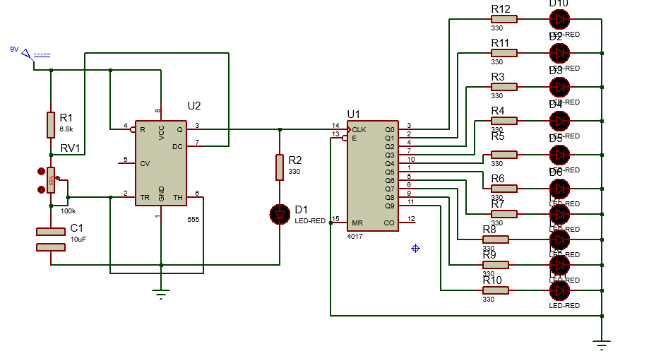
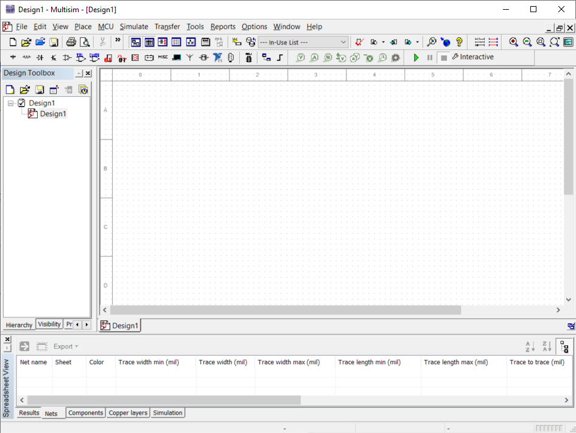
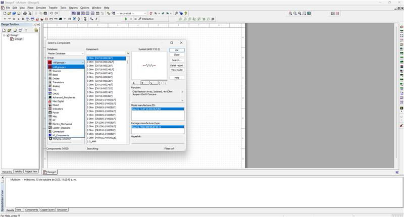

# Práctica #2 - Multisim

---

**Nombre del proyecto:** Simulación de LEDs Secuenciales  

**Equipo:** Sebastián Montaño y Juan Jacobo Flórez  

**Asignatura:** Producción Electrónica  

**Fecha:** 19/10/2025  

---

### Resumen

Esta práctica consistió en realizar un circuito secuencial básico en **NI Multisim**, utilizando un **temporizador 555** y un **contador CD4017** para generar un encendido progresivo de varios LEDs.  
El objetivo fue **familiarizarnos con las herramientas de simulación del software** y comprender la lógica de funcionamiento de un sistema secuencial simple antes de pasar a la fase de diseño físico de la PCB.

El circuito permitió observar de forma virtual cómo los LEDs se encendían uno a uno según la señal de reloj generada por el 555, confirmando el correcto funcionamiento del contador y de la simulación.

- 

---

### Entorno de Simulación y Herramientas

!!! note "Entorno de Simulación: NI Multisim"
    Multisim combina el diseño esquemático con instrumentos virtuales que imitan el funcionamiento de herramientas reales de laboratorio, como multímetros, generadores de señal y osciloscopios.

El entorno de trabajo está compuesto por el **área de diseño (Schematic)**, el **menú de componentes** (`Place > Component...`), la **barra de instrumentos virtuales** (al lado derecho), y los **controles de simulación** ubicados en la parte superior (▶️ *Run*, ⏸ *Pause*, ⏹ *Stop*).

- 

---

### Proceso de Diseño y Simulación

El diseño inició con la **búsqueda y colocación de componentes** desde la *Master Database* usando la barra **Filter**, seleccionando los elementos principales:

- **555 Timer (NE555N):** configurado en modo astable para generar una señal de reloj.  
- **Contador CD4017:** encargado de activar cada LED en secuencia con cada pulso.  
- **LEDs y resistencias limitadoras:** conectados a las salidas Q0–Q9 del 4017.  
- **Fuente de alimentación (Vcc) y tierra (GND).**

- 

Los componentes se colocaron sobre el área de trabajo, se rotaron con **Ctrl+R** y se editaron sus valores por medio de doble clic.  
Posteriormente se realizaron las conexiones siguiendo el diagrama lógico del circuito.

!!! warning "Importancia del 'GND'"
    Toda simulación necesita una referencia de **0V (tierra)**.  
    Si se omite, Multisim mostrará el error “*Simulation failed to converge*”.

Una vez completado el cableado, se ejecutó la simulación presionando **Run (▶️)**.  
El temporizador 555 generó una señal periódica que alimentó el pin de reloj del 4017, activando de forma secuencial cada salida y encendiendo los LEDs uno tras otro.

El **multímetro virtual** se utilizó para comprobar los valores de **voltaje y corriente** en los nodos principales del circuito, verificando la correcta alimentación de los componentes.

---

### Tipos de Simulación en Multisim

Durante la práctica se utilizó la simulación **interactiva**, pero Multisim permite otras modalidades de análisis según el tipo de estudio deseado:

- **Transitoria (Time Domain):** observa la evolución temporal de la señal del 555.  
- **Análisis DC:** muestra el comportamiento en estado estacionario.  
- **Análisis AC:** útil para circuitos con respuesta en frecuencia.  
- **Barrido Paramétrico:** permite variar el valor de un componente, como la resistencia o el capacitor del 555, y analizar su efecto en la frecuencia del reloj.

---

### Validación y Resultados

La simulación mostró un **funcionamiento correcto del sistema secuencial**:  
el 555 generó una onda cuadrada continua y el 4017 activó cada LED en orden con cada pulso.  
El circuito respondió tal como se esperaba, demostrando la relación entre la frecuencia del temporizador y la velocidad de cambio de los LEDs.

!!! success "Conclusión Técnica"
    La simulación permitió comprobar el principio de operación de un sistema de luces secuenciales controlado por un 555 y un 4017, facilitando su comprensión antes de su implementación física.

<figure style="text-align:center;">
  <video width="100%" style="max-width:800px;" controls muted loop>
    <source src="/recursos/Videos/multisim_luces.mp4" type="video/mp4">
    Tu navegador no soporta la reproducción de video.
  </video>
  <figcaption style="font-size:0.9em; color:gray;">Simulación de luces en Multisim</figcaption>
</figure>

---

### Conclusiones 

La práctica permitió comprender la **interacción entre componentes digitales y temporizadores** dentro de un entorno de simulación.  
Se comprobó que Multisim es una herramienta útil para **visualizar el comportamiento de los circuitos** y realizar ajustes de forma rápida antes del prototipado.

* El 555 y el 4017 permiten implementar fácilmente secuencias de encendido.  
* La simulación reduce errores y agiliza la validación de conceptos.  
* Multisim facilita el aprendizaje visual del flujo de señales y sincronización digital.

---

git add .

git commit -m "Actualizar documentacion porfi5"

git push