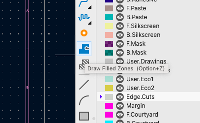
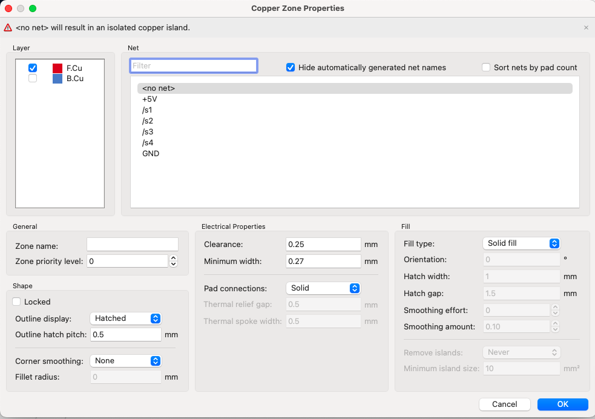
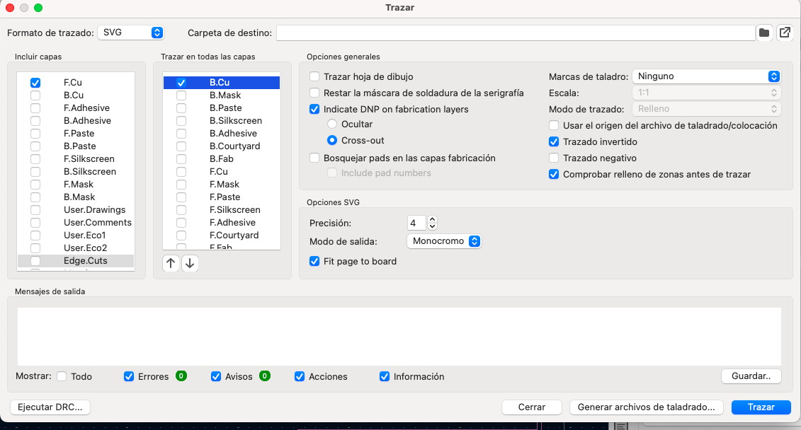
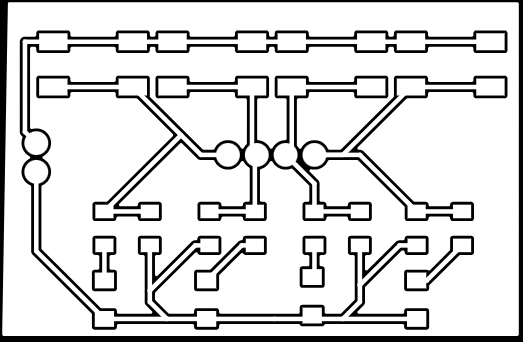
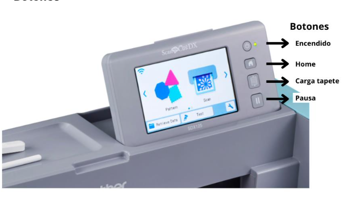
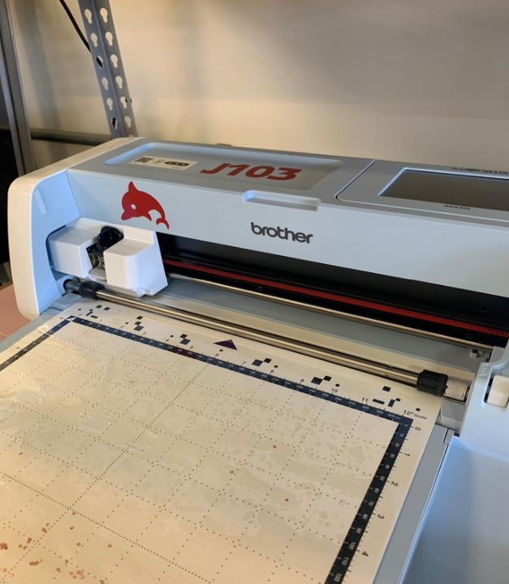
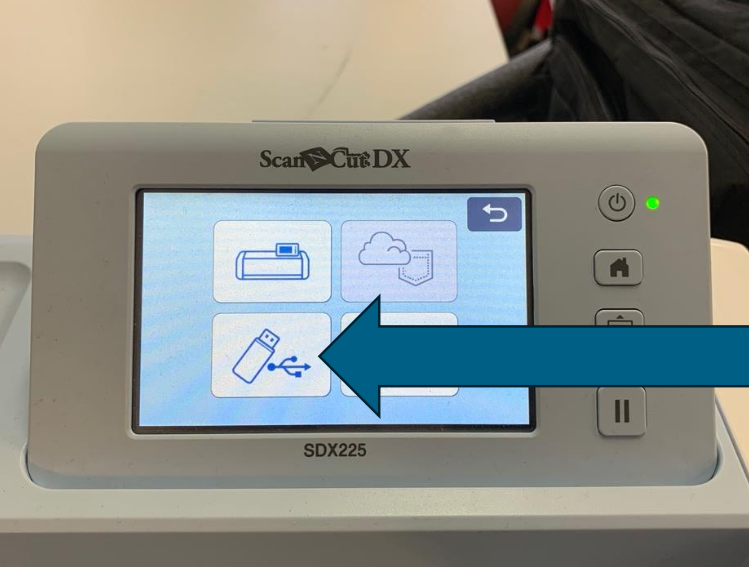

# Práctica #3 - PCB's en Vinil

---

**Nombre del proyecto**: Fabricación de PCB Flexible con Cortadora de Vinil

**Equipo:** Sebastián Montaño y Juan Jacobo Flórez

**Asignatura:** Producción Electrónica

**Fecha:** 2/10/2025

---

### Resumen

La práctica consistió en gran parte en adaptar tecnologías de fabricación digital, específicamente una cortadora de vinil Brother, para el prototipado rápido de circuitos impresos flexibles. El objetivo fue desarrollar un flujo de trabajo completo desde la preparación de archivos en KiCad hasta la ejecución del corte sobre cinta de cobre. 

Los resultados, aunque todavía no funcionales, demuestran que el proceso se encuentra en una fase temprana de caracterización. Se identificaron desafíos significativos relacionados con la naturaleza del material, el cual, al ser una cinta delgada no rígida, tiende a arrugarse y atorarse en la navaja, es probable que se deba a un fallo en el carro de la cortadora. Además, limitaciones en los parámetros de calibración de la máquina y problemas mecánicos durante el proceso requieren optimización para lograr resultados confiables.

---

### Preparación de Archivos en KiCad

A diferencia de un proceso de fresado, la cortadora de vinil sigue líneas vectoriales. Por ello, fue necesario invertir la lógica del diseño para que la máquina cortara el material de aislamiento entre las pistas.

!!! danger "Paso Necesario: Exportación en Negativo"
    La cortadora está diseñada para seguir líneas. Si se exporta el diseño normal, cortaría las pistas como líneas, haciendo inviable el circuito. Al exportar en negativo, las líneas que la máquina sigue son las del aislamiento entre pistas, que es precisamente el cobre que queremos remover.

#### Creación de la Máscara de Aislamiento

El procedimiento inició en el editor de placas de KiCad utilizando la herramienta **"Draw Filled Zones"** (Agregar zona rellena).

**Proceso paso a paso:**

1. **Activar la herramienta:** Se seleccionó "Draw Filled Zones" en el panel de herramientas del editor de placas.

    { align="center" width="96%" }

2. **Configurar la zona:** Al hacer clic en la placa, apareció un cuadro de diálogo donde se configuró:
    - **Layer:** F.Cu (capa frontal de cobre)
    - **Net:** `<no net>` (sin conexión a red específica)
    - **Clearance:** 0.25 mm
    - **Minimum width:** 0.27 mm
    - **Pad connections:** Solid
    - **Zone priority level:** 0

{ align="center" width="96%" }

3. **Dibujar el polígono:** Se dibujó un rectángulo o polígono que abarcaba toda el área de la placa, cubriendo completamente todas las pistas y componentes. Esto se hizo haciendo clic en cada esquina del área deseada.

4. **Cerrar el polígono:** Se completó el polígono haciendo doble clic o presionando Enter, lo cual creó una zona de cobre rellena que cubre toda la superficie.

5. **Rellenar la zona:** KiCad automáticamente calculó y rellenó el área, respetando las pistas existentes y creando el espacio de aislamiento alrededor de ellas, si esto no llega a pasar hay que presionar la tecla `B`.

!!! tip "Advertencia Normal"
    Al usar `<no net>` aparecerá una advertencia: "*<no net> will result in an isolated copper island*". Esto es normal y correcto para el propósito de crear una máscara completa de cobre.

{ align="center" width="96%" }    

#### Exportación en Negativo

Una vez creada la máscara de aislamiento, se procedió a exportar el diseño:

{ align="center" width="85%" }

1. **Acceder al menú de exportación:** En el editor de placas, se navegó a `Archivo` → `Salidas de fabricación` → `Trazado`

2. **Configurar la exportación:**
   - **Formato:** SVG (Scalable Vector Graphics)
   - **Capas:** Se seleccionó únicamente la capa de cobre con la zona rellena (F.Cu)
   - **Opciones críticas:**
     - ✓ **Trazado en negativo:** Esta opción invierte el diseño
     - ✓ **Excluir valor de los pads:** Para evitar texto innecesario
     - Modo de trazado: Líneas

3. **Generar el archivo:** Se hizo clic en "Plot" para crear el archivo SVG en negativo.

El resultado fue un archivo SVG donde las áreas que anteriormente eran pistas ahora son espacios vacíos (líneas de corte), y las áreas de aislamiento son ahora superficies sólidas que la cortadora de vinil seguirá como guías de corte.

{ align="center" width="80%" }
---

### Manual de uso Brother

[Revisar Manual PDF](recursos/archivos/Manual.pdf){ .md-button }

### Botones Principales de la Brother Scan N Cut SDX225

{ align="center" width="96%" }

**Posicionamiento correcto del tapete:** La máquina Brother Scan N Cut SDX225 requiere que el tapete adhesivo se coloque de manera específica, con la flecha del tapete señalando hacia adentro de la máquina.

{ align="center" width="75%" }

### Preparación del Tapete y Material

La correcta fijación de la cinta de cobre es un paso importante e influyente en los parámetros de corte elegidos. Al ser una lámina metálica muy delgada y sin rigidez (similar a un tape), su comportamiento es muy diferente al del vinil convencional.

**Adhesivo de Refuerzo:** Se aplicó una capa de pegamento extra sobre la cama adhesiva para contrarrestar la tendencia del material a moverse o arrugarse. Sobre esta se colocó una cama de sacrificio de vinil como protección, y finalmente la cinta de cobre sobre esta capa.

!!! warning "Área de Carga"
    Es importante asegurar que no haya material sobre los bordes negros del tapete, ya que esto puede interferir con el mecanismo de carga de la máquina.

**Carga del Material:** Con la cinta de cobre ya fijada, se posicionó el tapete alineando la flecha hacia adentro y se presionó el botón ubicado justo debajo del botón de `home` para cargar el tapete adhesivo en la máquina.

!!! tip "Mantenimiento del Tapete"
    Es indispensable limpiar el tapete con alcohol antes y después de cada uso. La acumulación de adhesivo y residuos de cobre puede afectar la planitud de la superficie y la calidad de futuros cortes. Para descargar el tapete, se presiona nuevamente el botón debajo de home.

---

### Proceso de Corte y Caracterización

Esta fase fue la más experimental. Se preparó el archivo en formato SVG (compatible con la máquina) en una memoria USB.

**Carga de archivos:** Se insertó la USB en el puerto ubicado en el costado derecho de la máquina. Con la máquina encendida y en la pantalla `Home`, se seleccionó la opción `Retrieve Data` y luego `Buscar dentro de USB` para acceder a los archivos compatibles (PHX, PHC, FCM, PES, SVG).

{ align="center" width="75%" }

**Posicionamiento del diseño:** Una vez seleccionado el archivo, la máquina mostró una cuadrícula representando el área de corte. Se utilizó la opción `Edit` para arrastrar con el dedo el dibujo completo y posicionarlo en una zona de la cuadrícula donde se confirmaba la presencia de material.

!!! tip "Prueba de Corte"
    Antes de ejecutar el trabajo completo, se recomienda realizar una prueba de corte en una pequeña esquina del material para verificar la presión y profundidad del corte sin arruinar toda la pieza.

#### Configuración de Parámetros

Para la configuración utilizada existen dos configuraciones con resultados positivos, se llegó a estas a través de experimentación y se accedió mediante la opción `cut` (corte) en el menú de configuración:

**Configuración 1:**
- **Cut speed:** 3
- **Cut pressure:** -9
- **Cut pressure manual:** -9
- **Cut amount:** auto
- **Half cut:** On
- **Pressure Half cut:** -2
 
**Configuración 2:** Este segundo grupo de parámetros dio muy buenos resultados.
- **Cut speed:** 1
- **Cut pressure:** -9
- **Cut pressure manual:** -1
- **Cut amount:** auto
- **Half cut:** On
- **Pressure Half cut:** -1

!!! warning "Limitaciones de Calibración"
    La máquina Brother Scan N Cut SDX225 solo permite valores de calibración en números enteros, con especificaciones vagas sobre las unidades y direcciones que cada parámetro representa. Esta falta de precisión hace difícil reproducir resultados consistentes entre intentos. Es necesario colocar el material sobre otro (por ejemplo, vinil) para evitar daños a la base de la máquina.

---

### Resultados y Desafíos Observados

Los principales fallos del proceso estuvieron directamente relacionados con la naturaleza no rígida de la cinta de cobre y limitaciones mecánicas de la máquina.

**Arrugamiento del metal:** La presión de la navaja a menudo provocaba que la delgada lámina de cobre se arrugara en lugar de ser cortada limpiamente, afectando especialmente en secciones donde se requería mayor precisión.

**Atascamiento en la navaja:** Pequeños fragmentos de cobre se quedaban atorados en la punta de la navaja, ocasionando que en trazados posteriores el material fuera desgarrado en lugar de cortado.

**Problemas mecánicos:** Una rotura en la máquina requirió mantener manualmente el cabezal durante el proceso de corte, lo que seguramente causó inconsistencias fundamentales en la profundidad y uniformidad del corte.

#### Limitaciones Identificadas

- **Repetibilidad limitada:** Los resultados variaban significativamente entre intentos, sugiriendo alta sensibilidad a condiciones iniciales, problemas de calibración y problemas con el estado actual de la máquina.
- **Desgaste de herramienta:** La navaja suponemos requiere reemplazo debido a la naturaleza abrasiva del cobre.
- **Falta de precisión en parámetros:** La imposibilidad de ajustar valores con decimales limita el control fino necesario para este tipo de material.

#### Aspectos Funcionales

A pesar de los desafíos, el proceso demostró viabilidad para prototipos de baja complejidad bajo condiciones óptimas.

---

### Conclusiones

El uso de cortadora de vinil para fabricación de PCB flexibles representa una alternativa interesante para prototipado rápido. Sin embargo, el proceso actual requiere:

1. **Caracterización sistemática:** Los parámetros de corte necesitan optimización basada en pruebas controladas.
2. **Mejoras en fijación:** Desarrollo de métodos más confiables para mantener la cinta de cobre plana y adherida durante todo el proceso.
3. **Resolución de limitaciones mecánicas:** Reparación o reemplazo de componentes dañados es fundamental para obtener resultados reproducibles.

La técnica se encuentra en fase experimental pero muestra potencial para circuitos simples y flexibles, representando una herramienta valiosa cuando se comprenden sus limitaciones actuales.