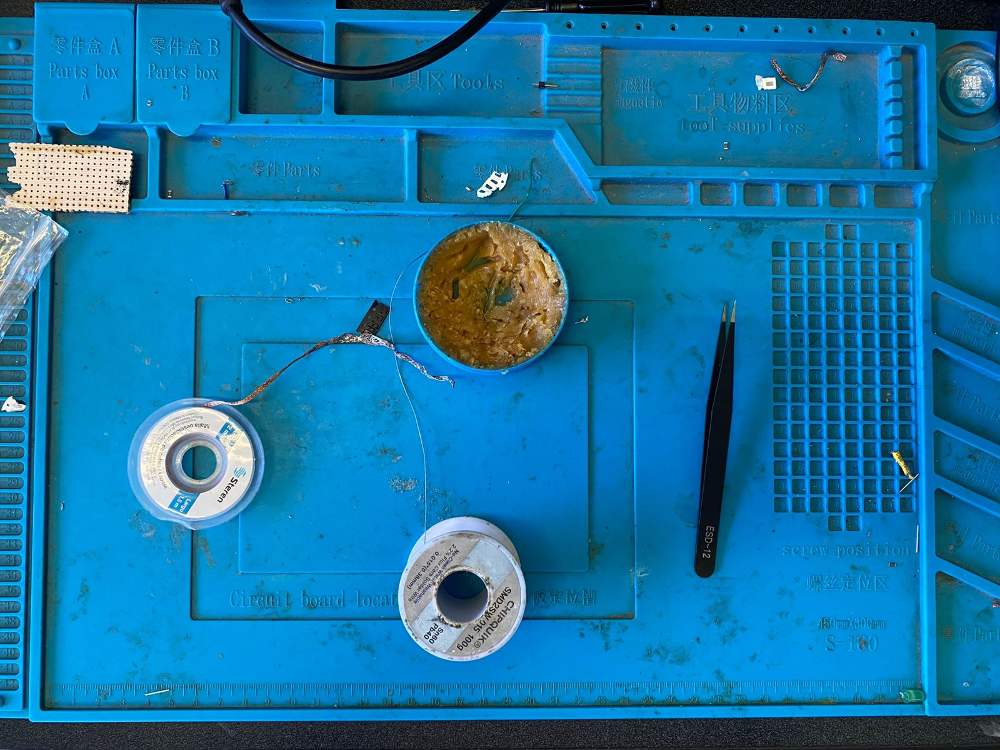
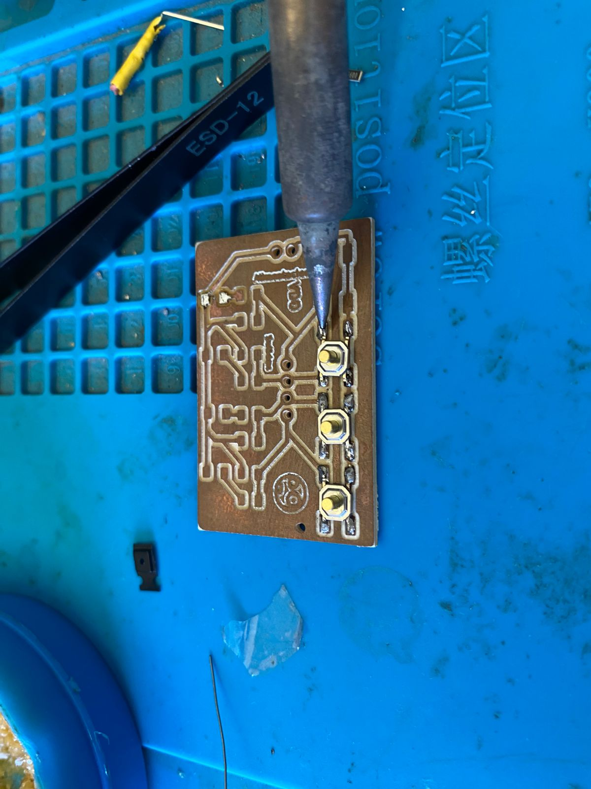
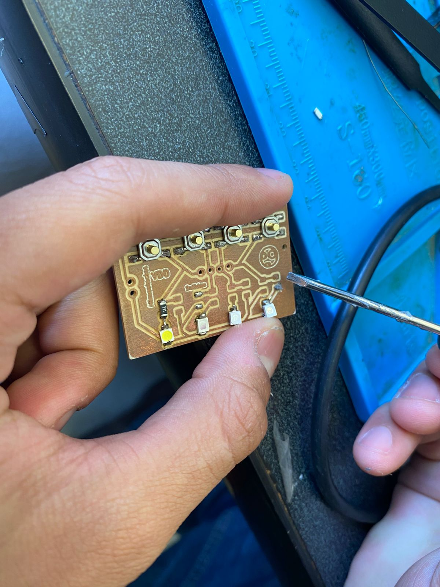
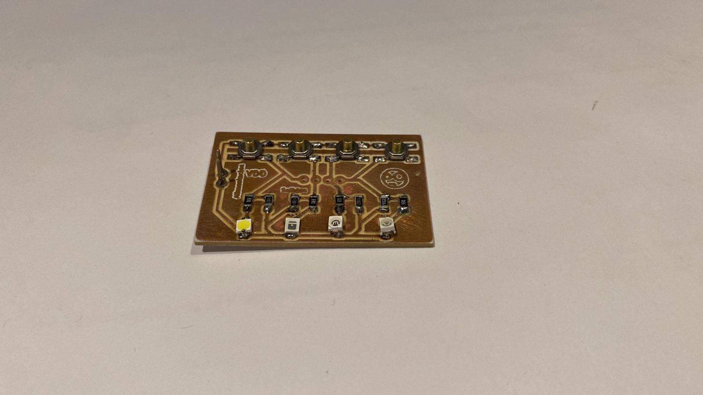
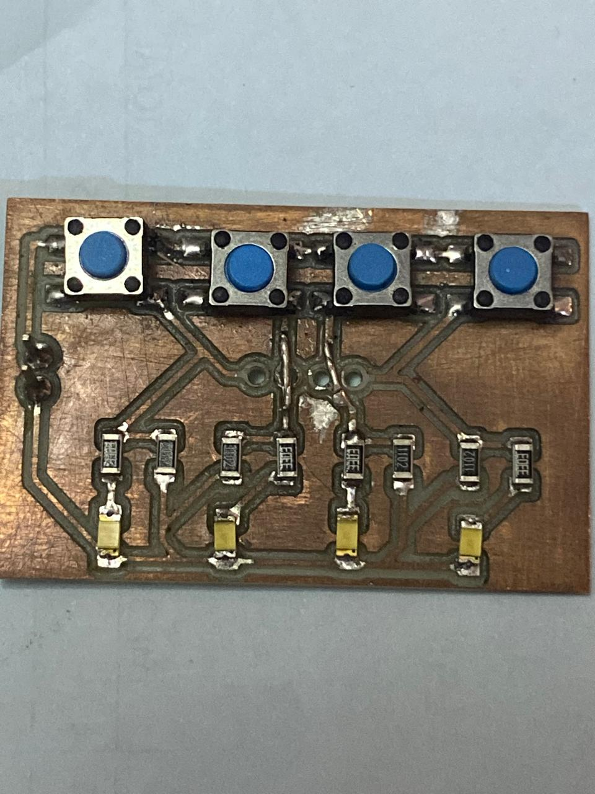

# Práctica #4 - Soldadura

---
**Nombre del proyecto**: Soldadura y Ensamblaje de Componentes

**Equipo:** Sebastián Montaño y Juan Jacobo Flórez

**Asignatura:** Producción Electrónica

**Fecha:** 12/10/2025 

---

### Resumen

Esta práctica documenta el proceso de ensamblaje manual de una placa de circuito impreso estándar (PCB), aplicando las técnicas de soldadura para componentes de montaje superficial (SMD) y de inserción (Through-Hole).
El objetivo fue desarrollar la destreza necesaria para realizar uniones de soldadura limpias, robustas y eléctricamente confiables.

Se empleó una técnica de anclaje para los SMD, un método de aplicación directa de pasta para componentes finos, y el método estándar de cono para THT.
El resultado final fue un circuito completamente funcional, validando las técnicas de soldadura empleadas, la importancia de la inspección y la necesidad de técnicas de corrección.

---

### Herramientas y Materiales

!!! note "Control de Temperatura"
Se ajustó el cautín a una temperatura de aproximadamente **340°C** para la soldadura convencional con estaño en hilo.
Para la soldadura con pasta, se utilizó una temperatura más alta (**420°C**) para lograr una fusión rápida sin sobrecalentar los componentes.

**Materiales y equipo utilizado:**

* **Estación de soldadura:** Regulable en temperatura, permite ajustar el calor específico según el tipo de soldadura.
* **Limpiador de punta:** Viruta de latón y esponja.
* **Pinzas antiestáticas:** De punta fina (rectas y curvas) para manipular componentes SMD muy pequeños.
* **Estaño en hilo:** Para soldadura estándar.
* **Pasta de soldar:** 
* **Flux adicional:** En pasta mejora la fluidez del estaño y corrige uniones.
* **Malla de desoldar:** Trenza de cobre que absorbe el exceso de estaño por capilaridad.
* **Alcohol isopropílico (90%+):** Limpieza de residuos de flux y suciedad.
* **Superficie de trabajo:** Tapete antiestático (ESD mat) resistente al calor.

- 

---

### Proceso de Soldadura: Componentes SMD

Para los componentes **1206**, se implementó la **técnica de anclaje**.

!!! tip "Técnica de Anclaje"
Este método convierte un problema de alineación (sostener el componente, el cautín y la soldadura simultáneamente) en dos pasos simples.
Anclar un lado primero inmoviliza la pieza, permitiendo soldar el segundo terminal con total estabilidad.

1. Aplicar una mínima cantidad de estaño a un solo pad.
2. Sostener el componente con pinzas y recalentar ese pad para fijar un extremo.
3. Con el componente ya inmovilizado, soldar el terminal restante.

- 

---

### Soldadura con Pasta para Soldar

Para los componentes SMD más pequeños, se empleó **pasta para soldar**, que ofrece mejor control y uniformidad en espacios reducidos.

Se aplicó una cantidad mínima directamente sobre los pads de cobre, evitando puentes entre pads adyacentes.

- 

!!! tip "Espesor de la Pasta"
La pasta debe formar una capa uniforme.
Si es demasiada, puede causar cortocircuitos; si es muy poca, no habrá unión sólida.

Con la pasta aplicada, se colocó el componente con pinzas y se aplicó calor con un cautín a **420°C**.

Tras la solidificación, se limpió el residuo de flux con alcohol isopropílico.

!!! warning "Ventajas y Limitaciones"
    La pasta para soldar es excelente para componentes pequeños y espaciados muy cerca, pero requiere mayor precisión en la aplicación. No es recomendable para soldaduras en cables.

---

### Proceso de Soldadura: Componentes Through-Hole (THT)

El objetivo principal fue asegurar la **perpendicularidad** de los pines respecto a la placa.

Se insertaron las tiras de pines, soldando un único pin en cada extremo para fijar la orientación, y luego el resto aplicando calor tanto al pad como al pin.

!!! note "La Unión Perfecta en Forma de Cono"
    Una soldadura THT correcta presenta una forma cóncava, similar a un pequeño volcán.
    Indica una conexión mecánica y eléctrica confiable.

---

### Técnicas de Corrección y Desoldadura

El ensamblaje manual rara vez es perfecto en el primer intento. En esta práctica, se aplicaron **tres técnicas de corrección** principales:

#### 1. Corrección de Soldaduras Frías

**Problema:** Uniones opacas o quebradizas por fusión incompleta (especialmente con pasta).
**Corrección:** Aplicar flux fresco, recalentar con cautín (420°C) hasta que la soldadura fluya y adquiera brillo.

#### 2. Remoción de Exceso de Soldadura

**Problema:** Puentes de estaño o uniones inestables (“bola”).
**Corrección:** Aplicar flux, colocar malla sobre la unión, calentar con cautín limpio hasta que el estaño sea absorbido.

#### 3. Reparación de Pistas Rotas 

**Problema:** Pistas de cobre levantadas o quebradas por calor o manipulación.
**Corrección:** Usar cable fino para crear un **puente directo** entre los pads correspondientes, restaurando la continuidad eléctrica.

!!! warning "ACLARACION"
    Es mejor no recurrir la mala practica de arreglar pistas rotas, en todo caso volver a fabricar si se cuenta con el tiempo es preferible.

---

### Inspección y Resultados Finales

Tras completar las soldaduras, se limpió la placa con alcohol isopropílico.

!!! tip "La Importancia de la Limpieza"
    El flux residual es ácido y puede ser corrosivo o crear caminos conductivos con el tiempo.
    Limpiar es esencial tanto por estética como por confiabilidad eléctrica.

#### Pruebas de Continuidad y Validación

La inspección visual y las pruebas con multímetro confirmaron la funcionalidad general, aunque se requirieron correcciones menores.

**Resultados de resistencia:**

* **Líneas de señal:** 11 kΩ (valor esperado: 1 kΩ — discrepancia sin impacto funcional)
* **Positivo de LEDs:** 330 Ω (valor correcto)

- 

- 

El circuito final resultó **operacional** y funcional tras las correcciones aplicadas.

---

