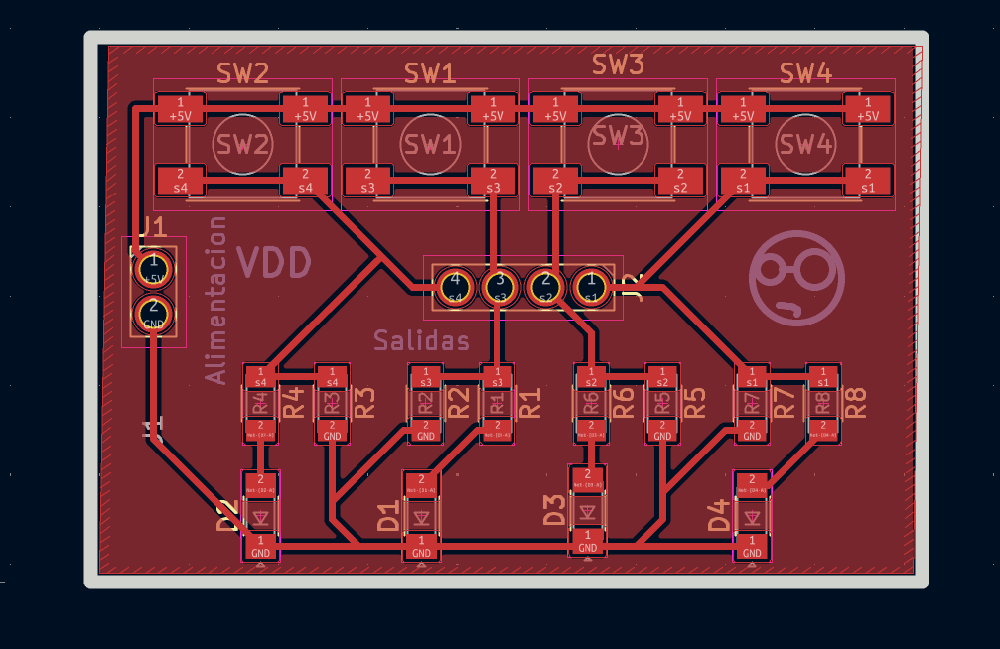
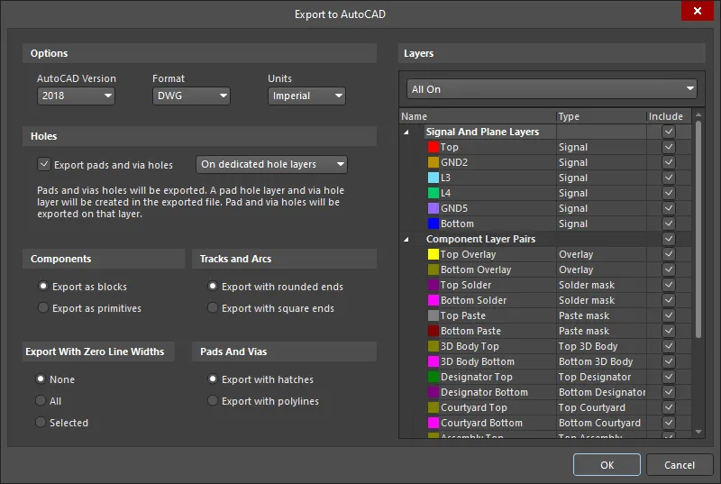

# Práctica #6 - Uso XTool F1 Ultra

---

**Nombre del proyecto**: Fabricación de PCB con Láser xTool F1

**Equipo:** Sebastián Montaño y Juan Jacobo Flórez

**Asignatura:** Producción Electrónica

**Fecha:** 1/12/2025

---

### Resumen

Esta práctica exploró el uso de la máquina láser xTool F1 como método alternativo para la fabricación de placas de circuito impreso. A diferencia de los métodos de fresado CNC, el láser ofrece la posibilidad de remover selectivamente el cobre de una placa mediante ablación térmica utilizando su función de fibra infrarroja (IR). El proceso involucró la preparación de archivos desde Altium Designer, configuración de parámetros en el software xTool Creative Space (XCS), y la ejecución del grabado láser sobre placas fenólicas FR4 y baquelita. Los resultados permitieron evaluar la viabilidad de esta tecnología para prototipado rápido de PCB, identificando sus ventajas en precisión y velocidad.

---

### Características de la xTool F1

La xTool F1 es una máquina láser híbrida que combina láser de diodo (10W) con módulo de fibra infrarroja (IR), este último específicamente diseñado para trabajar con metales.

**Especificaciones principales:**

- **Láser de Fibra IR:** Para grabado en metales como cobre
- **Área de trabajo:** 100mm × 100mm
- **Precisión:** Alta resolución para trabajos detallados
- **Sistema de enfoque:** Medición automática de altura
- **Cámara integrada:** Para posicionamiento preciso
- **Sistema de enfriamiento:** Requerido para operación del láser de fibra
- **Software:** xTool Creative Space (XCS)

!!! warning "Enfriador Obligatorio"
    Antes de iniciar cualquier trabajo con la fibra IR, es obligatorio encender el sistema de enfriamiento de la máquina. Operar sin enfriamiento puede dañar permanentemente el láser.

- 

---

### Preparación de Archivos desde Altium

#### Creación de Máscara de Aislamiento

Similar al proceso con la cortadora de vinil, fue necesario crear una máscara que cubriera toda la placa para luego exportar en formato que el láser pudiera interpretar.

**Proceso en Altium Designer:**

1. **Convertir outline a polígono:** 
   - Seleccionar el contorno de la placa (Board Shape)
   - Convertir a polígono para poder crear un pour

2. **Crear Copper Pour:**
   - **Place** → **Polygon Pour** o usar la herramienta de polígonos
   - Dibujar un polígono que cubra toda el área de la placa
   - Click derecho → **Properties**

3. **Configurar el Pour:**
   - **Net:** `No Net` o dejar sin asignar
   - **Layer:** Top Layer (capa de cobre superior)
   - **Connect Style:** Solid (relleno sólido)
   - **Remove Dead Copper:** Desactivar

4. **Rellenar polígono:** Click derecho en el polígono → **Polygon Actions** → **Repour All**

{ align="center" width="96%" }  

El resultado es una capa de cobre completamente rellena que cubre toda la placa.

!!! note "Propósito de la Máscara"
    La máscara de cobre rellena con `No Net` permite que al exportar en formato DXF, el láser grabe las áreas de aislamiento entre pistas, conservando el cobre donde están las pistas deseadas.

#### Exportación como DXF

1. **Acceder a exportación:** `File` → `Fabrication Outputs` → `DXF`
2. **Configurar opciones:**
   - Formato: DXF
   - Capa: Top Layer (con el pour relleno)
   - Unidades: Milímetros
3. **Generar archivo:** Guardar DXF para importar en XCS

{ align="center" width="96%" } 

---

### Preparación del Material

#### Materiales Utilizados

Se trabajó con dos tipos de placas de circuito impreso:

- **FR4 (Fibra de Vidrio):** Placa fenólica estándar, mayor resistencia mecánica
- **Baquelita:** Material fenólico económico.

**Preparación de la superficie:**

1. **Limpieza:** Limpiar la superficie con alcohol isopropílico para remover contaminantes
2. **Fijación:** Colocar la placa en la base de la xTool F1, asegurando que esté completamente plana
3. **Encender enfriador:** Activar el sistema de enfriamiento antes de cualquier operación

{ align="center" width="96%" } 

---

### Configuración en xTool Creative Space (XCS)

#### Importación y Posicionamiento

1. **Importar DXF:** Abrir XCS y arrastrar el archivo DXF al área de trabajo
2. **Verificar escala:** Confirmar que las dimensiones coincidan con el diseño original

**Uso de la cámara integrada:**

La xTool F1 incluye una cámara que permite posicionamiento visual preciso:

- **Captura en vivo:** Ver la placa en tiempo real dentro del software
- **Alineación:** Superponer el diseño digital sobre la imagen de la cámara
- **Ajuste fino:** Mover y rotar el diseño para alinearlo perfectamente con la placa física

**IMAGEN SUGERIDA:** `xtool_camara_alineacion.png` - Vista de la cámara con diseño superpuesto

#### Medición Automática de Altura

Antes del grabado, la máquina debe determinar la altura exacta de la superficie:

1. **Iniciar medición:** Seleccionar función de medición de altura en XCS
2. **Proceso automático:** El láser mide múltiples puntos de la superficie
3. **Compensación:** XCS ajusta automáticamente el enfoque para toda el área
4. **Verificación:** Confirmar que la medición fue exitosa

!!! tip "Superficie Plana Crítica"
    La placa debe estar perfectamente plana. Cualquier curvatura o irregularidad afectará el grabado. La medición automática compensa variaciones menores.

**IMAGEN SUGERIDA:** `xtool_medicion_altura.png` - Proceso de medición automática de altura

---

### Configuración de Parámetros y Grabado

#### Parámetros del Láser de Fibra IR

Los parámetros se ajustan específicamente para la fibra IR trabajando sobre cobre:

- **Modo:** Fibra IR (Infrared Fiber)
- **Material:** Metal - Cobre
- **Potencia:** [VALOR]% 
- **Velocidad:** [VALOR] mm/s
- **Frecuencia:** [VALOR] kHz
- **Pasadas:** [NÚMERO] 

**IMAGEN SUGERIDA:** `xtool_parametros_ir.png` - Panel de configuración de fibra IR en XCS

#### Proceso de Grabado

1. **Vista previa:** Verificar el recorrido del láser en XCS
2. **Iniciar trabajo:** Presionar Start
3. **Monitoreo:** Observar el proceso a través de la cámara integrada

**Durante el grabado:**

- El láser de fibra IR remueve el cobre en las áreas de aislamiento
- El proceso es rápido y preciso
- El sistema de enfriamiento mantiene la temperatura estable

**IMAGEN SUGERIDA:** `xtool_proceso_grabado.jpg` - Láser de fibra IR en operación

!!! warning "Seguridad con Láser IR"
    - El láser de fibra es invisible y extremadamente peligroso
    - Mantener siempre la cubierta cerrada durante operación
    - No intentar observar directamente el punto de trabajo
    - Asegurar que el sistema de enfriamiento esté funcionando

---

### Terminado con monoFab SRM-20

Una vez completado el grabado láser, la placa requiere procesos adicionales que se realizan en la fresadora CNC monoFab:

**Procesos necesarios:**

1. **Perforación de orificios:** Para componentes through-hole
   - Broca de 0.8-1.0 mm según diseño
   - Velocidad reducida para evitar romper brocas pequeñas

2. **Corte del contorno:** Definir la forma final de la placa
   - Fresa de 1/32" para contorno
   - Profundidad suficiente para cortar completamente el sustrato

**Flujo de trabajo completo:**

1. **xTool F1:** Grabado de pistas con láser de fibra IR
2. **monoFab SRM-20:** Perforación y corte de contorno
3. **Resultado:** PCB completa lista para ensamblaje

**IMAGEN SUGERIDA:** `xtool_resultado_final.jpg` - PCB completamente terminada después de ambos procesos

---

### Resultados y Conclusiones

#### Ventajas del Método Láser

- **Precisión:** Excelente definición de pistas finas
- **Velocidad:** Grabado significativamente más rápido que fresado
- **Sin desgaste de herramientas:** No requiere cambio de fresas
- **Repetibilidad:** Una vez configurado, resultados consistentes

**Conclusión general:**

El láser de fibra IR de la xTool F1 demostró ser una excelente opción para el grabado de pistas en PCB, ofreciendo velocidad y precisión superiores. La combinación con la monoFab SRM-20 para perforaciones y contorno permitió completar el proceso de fabricación satisfactoriamente, logrando placas funcionales listas para el ensamblaje de componentes.

