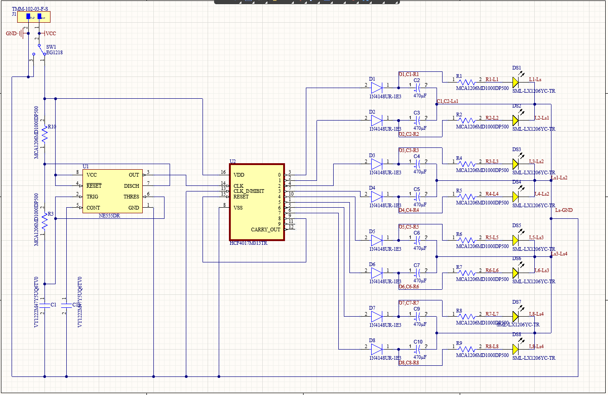
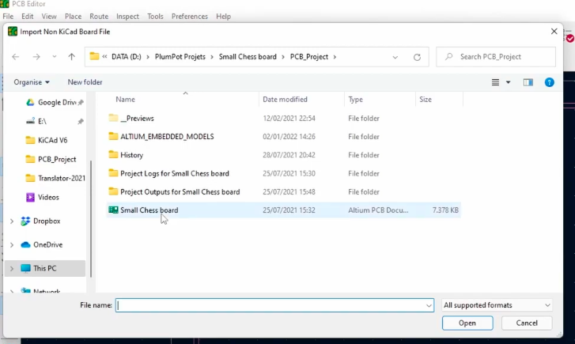

# Proyecto Final

---

**Nombre del proyecto**: Círculo Loading 

**Equipo:** Sebastián Montaño y Juan Jacobo Flórez

**Asignatura:** Producción Electrónica

**Fecha:** 1/12/2025

---

### Resumen

Este proyecto integró todos los conocimientos adquiridos en las prácticas anteriores para el diseño y fabricación de un dispositivo funcional: una placa electrónica con efecto de "rueda de carga" (loading spinner). El diseño combina electrónica digital y analógica para crear una secuencia visual de 8 LEDs con efecto de atenuación suave (fading). El proyecto se desarrolló completamente en Altium Designer, aplicando los criterios de diseño establecidos en prácticas previas. Originalmente planificado para fabricación con la xTool F1 ultra, problemas de calibración requirieron el uso de la monoFab SRM-20 para el proceso completo de fabricación. El resultado fue un circuito funcional y visualmente atractivo.

---

### Concepto y Funcionamiento del Circuito

#### Descripción General

El circuito implementa una rueda de carga visual mediante una secuencia de 8 LEDs que se encienden y apagan de forma secuencial, creando un efecto de movimiento circular. La característica distintiva es el efecto de atenuación suave (fading) que evita transiciones cuadradas entre LEDs.

**Especificaciones:**

- **Alimentación:** 4.5V (3 pilas AAA)
- **LEDs:** 8 LEDs en secuencia
- **Frecuencia:** ~3 Hz (cada LED encendido ~0.33 segundos)
- **Componentes:** SMD tamaño 1206 principalmente

#### Arquitectura del Circuito

El diseño se divide en tres bloques funcionales:

**1. Generación de Reloj (LMC555):**

El temporizador LMC555 genera la señal de reloj base del sistema.

- **Frecuencia:** 3 Hz
- **Función:** Proporcionar pulsos regulares al contador

**2. Lógica Secuencial (CD4017/74HC4017):**

El contador de décadas distribuye los pulsos secuencialmente a través de sus 10 salidas (Q0-Q9).

- **Configuración especial:** Pin de Reset (Pin 15) conectado a Q8 (Pin 9)
- **Resultado:** El contador se reinicia después de 8 pasos, creando un bucle perfecto

**3. Circuito de Fading (por cada LED):**

Cada LED tiene su propio circuito de atenuación, repetido 8 veces:

- **Diodo:** Evita que la carga del capacitor regrese al contador
- **Capacitor de fading (470µF):** Almacena energía y se descarga gradualmente
- **Resistor limitador:** Protección del LED

{ align="center" width="96%" } 

!!! note "Principio del Fading"
    Cuando el contador activa una salida, el capacitor se carga rápidamente a través del diodo. Al desactivarse, el capacitor se descarga lentamente a través del LED, creando el efecto de atenuación gradual que da sensación de  fluidez.

---

### Diseño en Altium Designer

El proyecto aplicó las técnicas aprendidas en prácticas anteriores, especialmente de la Práctica #5 (Introducción a Altium).

#### Selección de Componentes

**Componentes principales:**

| Componente | Especificación | Package | Cantidad |
|------------|----------------|---------|----------|
| Temporizador | LMC555 | SOIC-8 | 1 |
| Contador | CD4017/74HC4017 | SOIC-16 | 1 |
| LEDs | SMD | 1206 | 8 |
| Diodos | 1N4148 | SOD-80 | 8 |
| Capacitor fading | 470-1000µF | E-Case | 8 |
| Resistores | Varios valores | 1206 | 10 |
| Capacitores | Varios valores | THT | 3 |

{ align="center" width="96%" } 

**Criterios aplicados:**

- **Forma:** Diseño circular adaptado a la forma de la rueda de carga
- **Separación de pistas:** 0.4 mm (estándar de prácticas anteriores)
- **Distribución de LEDs:** Espaciado uniforme en arco para efecto visual óptima

---

### Fabricación del PCB

#### Preparación de Archivos

Dado que la fabricación se realizaría finalmente con la monoFab SRM-20, y el flujo de trabajo establecido en prácticas anteriores utiliza archivos SVG generados desde KiCad a través de Mods CE, fue necesario migrar el diseño desde Altium.

**Proceso de importación a KiCad:**

1. **Abrir KiCad PCB Editor:** Iniciar el editor de placas
2. **Importar archivo:** `File` → `Import` → `Non-KiCad Board File`

{ align="center" width="96%" } 

3. **Seleccionar archivo:** Elegir el archivo `.PcbDoc` guardado de Altium

{ align="center" width="96%" } 

4. **Mapeo de capas:** KiCad solicitará relacionar las capas de Altium con capas de KiCad
   - **Obligatorio:** Relacionar capa superior (Top Layer) e inferior (Bottom Layer)
   - **Recomendado:** Relacionar también capas de contorno (Edge.Cuts) y etiquetas relevantes (Silkscreen)
5. **Importación completada:** El diseño se carga en KiCad con todos los componentes, pistas y contornos

!!! warning "Verificación Post-Importación"
    Después de la importación, es importante verificar que todos los elementos se hayan transferido correctamente: dimensiones de pistas, posición de pads y vías, contorno de la placa, y que las capas estén correctamente asignadas.

**Exportación desde KiCad a SVG:**

Una vez verificado el diseño en KiCad:

1. **Exportar capas:** `File` → `Salidas de fabricacion`→ `Gerber`
   - Formato: SVG
   - Capas necesarias: F.Cu (pistas), Edge.Cuts (contorno), User.1 (hoyos)
   - ✓ Fit page to board

2. **Archivos generados:** SVG listos para Mods CE

**Procesamiento en Mods CE:**

El proceso de conversión de archivos SVG a código G (.rml) para la monoFab se realizó utilizando Mods CE, tal como se describe detalladamente en la **Práctica #1**. Este flujo incluye configuración de herramientas, velocidades, profundidades y generación de archivos de corte para cada capa.

#### Fabricación con monoFab SRM-20

Aunque inicialmente se planeó utilizar la xTool F1 con láser de fibra IR (Práctica #5), problemas de calibración de la máquina requirieron cambiar a la monoFab SRM-20 para todo el proceso.

**Proceso completo en monoFab:**

1. **Grabado de pistas:**
   - Herramienta: Fresa 1/64
   - Configuración de offset: 2 pasadas para limpieza
   - Velocidad: 4 mm/s

2. **Perforación de orificios:**
   - Broca: 0.8 mm
   - Velocidad: 0.8 mm/s

3. **Corte de contorno:**
   - Herramienta: Broca 1-2 mm
   - Velocidad: 2 mm/s

---

### Ensamblaje y Soldadura

El proceso de soldadura aplicó las técnicas de la Práctica #4.

**Secuencia de soldadura:**

1. **Componentes SMD pequeños primero:**
   - Resistores 1206
   - Diodos

2. **Chips integrados:**
   - LMC555
   - CD4017

3. **LEDs:**
   - Atención a polaridad

4. **Capacitores electrolíticos:**
   - Componentes más grandes (E-Case)
   - Verificación de polaridad crítica
   - Soldadura cuidadosa por tamaño

{ align="center" width="70%" } 

---

### Pruebas y Resultados

#### Validación Funcional

**Pruebas realizadas:**

1. **Continuidad:** Verificación de todas las conexiones con multímetro
2. **Polaridad:** Confirmación de orientación correcta de componentes polarizados
3. **Funcionamiento:** Verificación de secuencia de LEDs

**Resultados:**

- Secuencia de LEDs funcionando correctamente
- Efecto de fading visible y suave
- Frecuencia de 3 Hz lograda
- Consumo dentro de especificaciones

{ align="center" width="65%" } 

El resultado fue un dispositivo  que demuestra la aplicación práctica de conceptos teóricos en un producto. El proyecto mostro la importancia de la flexibilidad (cambio de xTool a monoFab) y la integración de conocimientos adquiridos para lograr un resultado exitoso.

